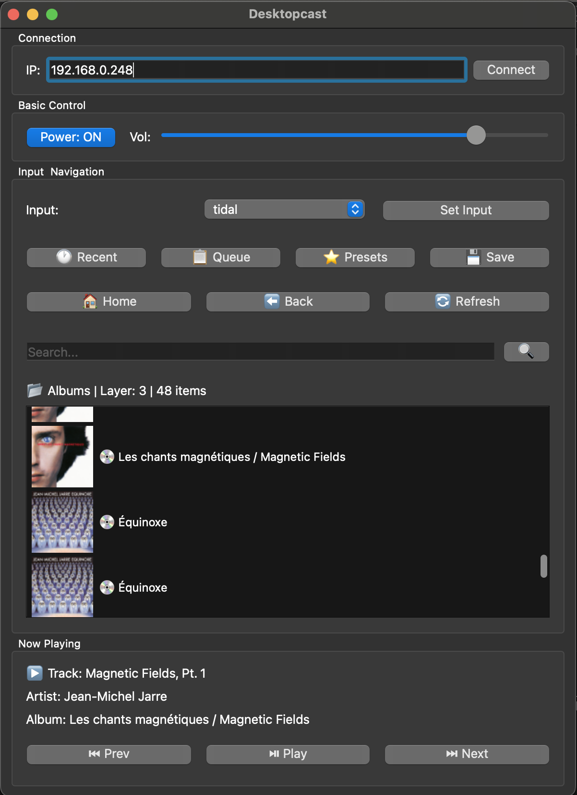

# 🎵 Desktopcast

<p align="center">
  
  
  
  
</p>

<p align="center">
  <strong>A beautiful desktop application for controlling Yamaha MusicCast receivers</strong>
</p>

<p align="center">
  Browse Tidal, Spotify, and more directly from your desktop. Control volume, playback, and navigate your music library with ease.
</p>

---

## ✨ Features

- 🎛️ **Full Receiver Control** - Power, volume, and input selection
- 🎵 **Music Browsing** - Navigate Tidal, Spotify, Deezer, Qobuz, and more
- 🔍 **Search** - Search your streaming services directly
- 📋 **Queue Management** - View and manage your play queue
- 🕐 **Recent Items** - Quick access to recently played content
- ⭐ **Presets** - Save and recall your favorite stations/playlists
- 🖼️ **Album Art** - Beautiful thumbnail display for your music
- 🔄 **Live Updates** - Real-time status polling

## 📸 Screenshots

<!-- Add screenshots here -->
<!--  -->

## 🚀 Installation

### Prerequisites

- Python 3.9 or higher
- A Yamaha receiver with MusicCast/YXC support
- Your receiver's IP address (find it in your router or receiver's network settings)

### Option 1: Install from source

```bash
# Clone the repository
git clone https://github.com/YOUR_USERNAME/Desktopcast.git
cd Desktopcast

# Create a virtual environment (recommended)
python -m venv venv
source venv/bin/activate  # On Windows: venv\Scripts\activate

# Install dependencies
pip install -r requirements.txt

# Run the application
python main.py
```

### Option 2: Download release (coming soon)

Pre-built binaries for Windows, macOS, and Linux will be available in the [Releases](https://github.com/YOUR_USERNAME/Desktopcast/releases) section.

## 🎮 Usage

1. **Connect to your receiver**
   - Enter your Yamaha receiver's IP address
   - Click "Connect"

2. **Control playback**
   - Use the transport controls (play, pause, previous, next)
   - Adjust volume with the slider

3. **Browse your music**
   - Select an input source (Tidal, Spotify, etc.)
   - Navigate through menus by clicking items
   - Use the search function to find specific content

4. **Manage your queue**
   - Click "Queue" to see currently queued tracks
   - Use "Recent" for recently played items
   - Save favorites to presets

## 🔧 Configuration

The default receiver IP is `192.168.0.248`. You can change this in the application's connection field.

To enable debug output, set `DEBUG = True` in `main.py`.

## 📡 Supported Devices

This application works with Yamaha receivers that support the **Yamaha Extended Control (YXC) API**, including:

- Yamaha RX-V series
- Yamaha RX-A series  
- Yamaha WXA/WXC series
- Other MusicCast-enabled devices

## 🤝 Contributing

Contributions are welcome! Here's how you can help:

1. Fork the repository
2. Create a feature branch (`git checkout -b feature/amazing-feature`)
3. Commit your changes (`git commit -m 'Add amazing feature'`)
4. Push to the branch (`git push origin feature/amazing-feature`)
5. Open a Pull Request

Please read [CONTRIBUTING.md](CONTRIBUTING.md) for details on our code of conduct and the process for submitting pull requests.

## 📋 Roadmap

- [ ] Multi-room/zone support
- [ ] System tray integration
- [ ] Keyboard shortcuts
- [ ] Dark/light theme toggle
- [ ] Pre-built binaries for all platforms
- [ ] Auto-discovery of receivers on network

## 📄 License

This project is licensed under the MIT License - see the [LICENSE](LICENSE) file for details.

## 🙏 Acknowledgments

- Yamaha for the MusicCast API
- The PyQt team for the excellent GUI framework
- All contributors and users of this project

## 📬 Support

- 🐛 Found a bug? [Open an issue](https://github.com/YOUR_USERNAME/Desktopcast/issues)
- 💡 Have an idea? [Start a discussion](https://github.com/YOUR_USERNAME/Desktopcast/discussions)
- ⭐ Like this project? Give it a star!

---

<p align="center">
  Made with ❤️ for the MusicCast community
</p>
